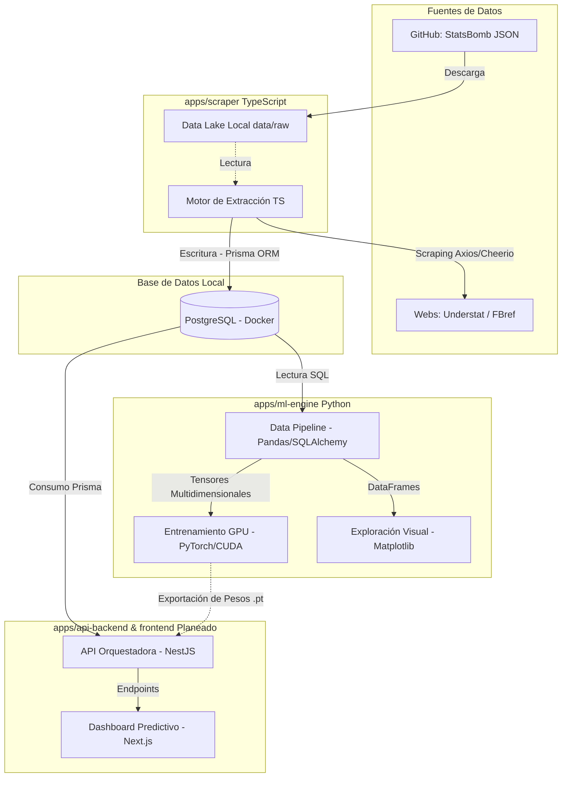

# Blueprint: Deep-Project (Predicción Deportiva)

## Visión General
Sistema de arquitectura híbrida para la ingesta, almacenamiento y procesamiento tensorial de métricas avanzadas de fútbol (xG, PPDA) con el objetivo de entrenar modelos predictivos de Deep Learning.

## Especificaciones de Hardware & Entorno
* **OS:** Windows 11
* **CPU:** Intel i7-12700KF
* **GPU:** NVIDIA RTX 4060 (8GB VRAM)
* **Aceleración:** CUDA 12.1 habilitado para PyTorch
* **Contenedores:** Docker Desktop activo para bases de datos

---

## Estructura del Monorepositorio

```text
deep-project/
├── apps/
│   ├── scraper/                # Extracción de datos de la web
│   │   ├── prisma/             # Esquema de BD y migraciones
│   │   ├── prisma.config.ts    # Configuración de Prisma v7+
│   │   └── index.ts            # Lógica de scraping y guardado
│   ├── ml-engine/              # Motor de Inteligencia Artificial
│   │   ├── .venv/              # Entorno virtual de Python
│   │   ├── pipeline.py         # Conexión DB, gráficas y tensores
│   │   └── modelos/            # (Futuro) Scripts de entrenamiento
│   ├── api-backend/            # (Futuro) Backend NestJS
│   └── frontend/               # (Futuro) Dashboard Next.js
├── data/
│   └── raw/                    # Data Lake: JSONs masivos (Ignorado en Git)
├── docker-compose.yml          # Configuración del contenedor PostgreSQL
├── ARQUITECTURA.md             # Este documento
└── .gitignore                  # Exclusión de módulos, venvs y data cruda

```

---

## Flujo de Datos (El Pipeline)

### Fase 1: Ingesta (TypeScript + Node.js)

El módulo `apps/scraper` se encarga de recolectar la "materia prima".

* **Herramientas:** TypeScript, Axios, Cheerio.
* **Objetivo:** Extraer métricas limpias (Goles Esperados - xG) de plataformas online o archivos JSON estáticos.
* **ORM:** Prisma v7 con adaptador nativo `pg` inyecta los datos de forma relacional evitando duplicados (Upsert).

### Fase 2: Almacenamiento Frio (PostgreSQL)

Contenedor Docker levantado en el puerto `5432`.

* **Tabla `Team`:** Catálogo de equipos oficiales.
* **Tabla `Match`:** Registro histórico con IDs únicos, fechas, resultados tradicionales y métricas avanzadas (xG local, xG visitante).

### Fase 3: Procesamiento Tensorial (Python + PyTorch)

El módulo `apps/ml-engine` convierte los registros SQL en matemáticas para la GPU.

* **Conexión:** `SQLAlchemy` y `psycopg2` extraen los datos vía queries.
* **Análisis:** `Pandas` estructura los DataFrames y `Matplotlib` genera gráficas de correlación.
* **Entrenamiento:** Los datos se convierten en tensores de PyTorch de tipo `float32` y se envían a la memoria de la RTX 4060 (CUDA) para alimentar modelos predictivos (XGBoost, LSTMs).

---

## Protocolos de Ejecución Rápida

**1. Levantar la Base de Datos:**
```powershell
docker-compose up -d
```

**2. Ejecutar Scraper / Migraciones (TypeScript):**
```powershell
cd apps\scraper
npx prisma migrate dev
npx ts-node index.ts
```

**3. Ejecutar Pipeline de Machine Learning (Python):**
```powershell
cd apps\ml-engine
.venv\Scripts\activate
python pipeline.py
```


